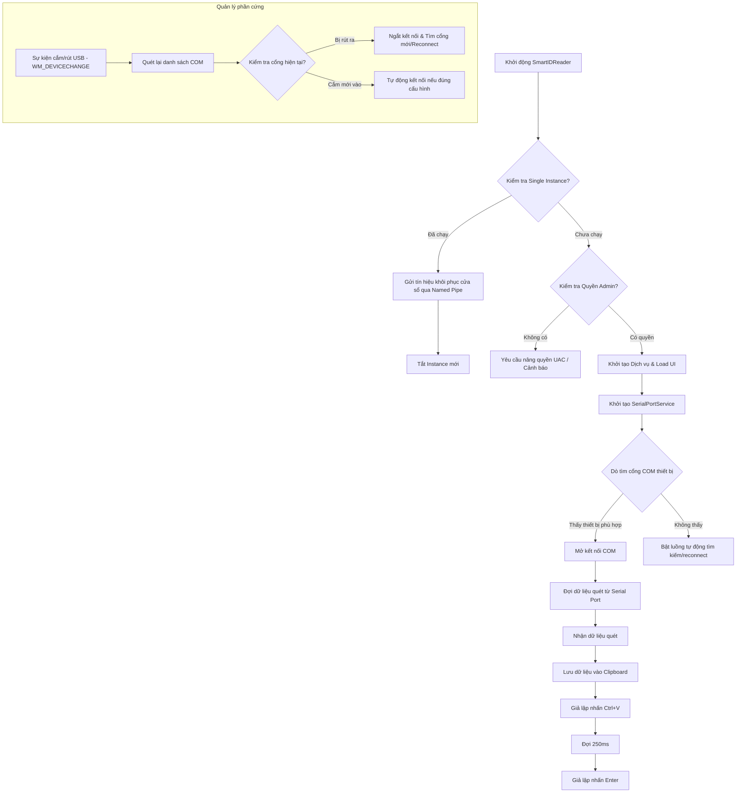

# SmartIDReader (Scan-Id-Card-Driver)

**SmartIDReader** là ứng dụng Windows Desktop (WPF, .NET) hỗ trợ kết nối, tự động phát hiện và đọc dữ liệu từ các thiết bị đọc thẻ Căn cước công dân (CCCD) gắn chip hoặc các thiết bị đọc thẻ thông minh qua cổng nối tiếp (Serial/COM). 

Dữ liệu đọc được sẽ tự động sao chép vào Clipboard và giả lập tổ hợp phím để điền trực tiếp vào bất kỳ phần mềm hoặc biểu mẫu web nào đang mở, giúp tối ưu hóa quy trình nhập liệu và giảm thiểu sai sót thủ công.

---

## 🌟 Tính năng nổi bật

*   **Tự động nhận diện cổng COM (Auto-Detect):** Dò tìm và kết nối nhanh các thiết bị sử dụng driver phổ biến như CH340, Prolific (PL2303), FTDI, Silicon Labs (CP210x), v.v.
*   **Theo dõi phần cứng thời gian thực (Hot-plugging):** Lắng nghe thông điệp Windows (`WM_DEVICECHANGE`) để tự động quét lại cổng COM và tái kết nối ngay khi người dùng cắm hoặc rút thiết bị USB.
*   **Tự động kết nối lại (Auto-Reconnect):** Thiết lập luồng ngầm thăm dò thiết bị. Nếu mất kết nối đột ngột, phần mềm sẽ liên tục thử kết nối lại cho đến khi thiết bị được cắm trở lại.
*   **Giả lập bàn phím thông minh:** Tự động thực hiện lệnh dán dữ liệu (`Ctrl + V`) và nhấn phím `Enter` vào ứng dụng đang active với độ trễ tối ưu (150ms/250ms), giúp tích hợp liền mạch với mọi CRM, ERP hoặc Website.
*   **Khởi chạy cùng Windows (Auto-start):** Tích hợp ghi khóa Registry khởi động cùng hệ điều hành dưới dạng thu nhỏ ẩn dưới khay hệ thống (System Tray).
*   **Chạy duy nhất một Instance (Single Instance):** Sử dụng hệ thống Named Mutex và Named Pipe Server để ngăn chặn việc chạy song song nhiều cửa sổ. Khi khởi chạy instance thứ hai, ứng dụng sẽ tự động gửi tín hiệu để kích hoạt và đưa cửa sổ hiện tại của instance thứ nhất lên tiền cảnh (topmost/activate).
*   **Giao diện giám sát trực quan (Terminal Log):** Tích hợp Serilog hiển thị thông tin nhật ký kết nối, trạng thái và dữ liệu quét trực tiếp trên màn hình ứng dụng với cơ chế tự động dọn dẹp bộ nhớ đệm log tránh tràn RAM.
*   **Kiểm tra quyền quản trị tối cao (Admin elevation):** Cảnh báo hoặc tự động yêu cầu nâng quyền Run as administrator để đảm bảo các tiến trình mô phỏng bàn phím và ghi Registry hoạt động trơn tru.

---

## 🏗️ Luồng hoạt động & Kiến trúc hệ thống

Sơ đồ dưới đây mô tả luồng nhận diện thiết bị, xử lý dữ liệu quét và tương tác của ứng dụng với Windows OS:



---

## ⚙️ Cấu hình hệ thống (`settings.setting`)

Tệp cấu hình của ứng dụng được lưu trữ dưới định dạng JSON trong tệp `settings.setting` cùng thư mục với file thực thi. Các thông số có thể tùy chỉnh bao gồm:

| Cấu hình | Kiểu dữ liệu | Giá trị mặc định | Mô tả |
| :--- | :--- | :--- | :--- |
| `Port` | `string` | `""` | Cổng COM được chỉ định (e.g. `COM3`). Nếu để trống sẽ kích hoạt Auto-detect. |
| `VendorId` | `string` | `""` | VID của chip USB để nhận diện phần cứng cụ thể. |
| `ProductId` | `string` | `""` | PID của chip USB để nhận diện phần cứng cụ thể. |
| `DeviceName` | `string` | `""` | Tên thiết bị thân thiện (Friendly Name). |
| `BaudRate` | `int` | `9600` | Tốc độ truyền baud rate (e.g. `9600`, `115200`). |
| `DataBits` | `int` | `8` | Số bit dữ liệu (`5`, `6`, `7`, `8`). |
| `Parity` | `string` | `"none"` | Bit kiểm tra lỗi chẵn lẻ (`none`, `odd`, `even`, `mark`, `space`). |
| `StopBits` | `float` | `1.0` | Số stop bit (`1`, `1.5`, `2`). |
| `Encoding` | `string` | `"utf8"` | Bộ mã hóa dữ liệu đọc được (`utf8` hoặc `ascii`). |
| `StartWithWindows`| `bool` | `false` | Tự động khởi chạy khi mở máy Windows. |
| `AutoReconnect` | `bool` | `true` | Tự động kết nối lại khi thiết bị mất kết nối. |
| `ReconnectIntervalSeconds` | `int` | `5` | Chu kỳ thăm dò thiết bị khi mất kết nối (giây). |

---

## 🚀 Hướng dẫn phát triển & Biên dịch

### Yêu cầu hệ thống
*   **Hệ điều hành:** Windows 10/11
*   **Bộ phát triển:** .NET 8.0 SDK (hoặc phiên bản tương đương được khai báo trong tệp `.csproj`)
*   **IDE:** Visual Studio 2022 trở lên

### Các bước biên dịch từ mã nguồn

1.  **Clone repository:**
    ```bash
    git clone git@github.com:UUID130225/Scan-Id-Card-Driver.git
    cd Scan-Id-Card-Driver
    ```

2.  **Khôi phục các gói phụ thuộc (NuGet dependencies):**
    ```bash
    dotnet restore
    ```

3.  **Biên dịch dự án:**
    ```bash
    dotnet build -c Release
    ```

4.  **Publish ứng dụng dạng Portable (Single File / Self-contained nếu cần):**
    ```bash
    dotnet publish -c Release -r win-x64 --self-contained true -p:PublishSingleFile=true -p:PublishReadyToRun=true
    ```

---

## 🛠️ Tham số khởi chạy (Command Line Arguments)

Ứng dụng hỗ trợ các tham số dòng lệnh sau khi khởi chạy:

*   `--hidden`: Khởi động ứng dụng ở chế độ chạy ẩn dưới khay hệ thống (System Tray), không hiển thị cửa sổ chính khi load. Thường dùng cho tính năng khởi chạy cùng Windows.
*   `--no-admin`: Cho phép bỏ qua kiểm tra quyền Administrator và khởi chạy bình thường (lưu ý: giả lập phím có thể bị Windows chặn trên các cửa sổ đang chạy quyền admin khác).
*   `--no-mutex`: Bỏ qua kiểm tra Single Instance, cho phép mở song song nhiều tiến trình `SmartIDReader`.
